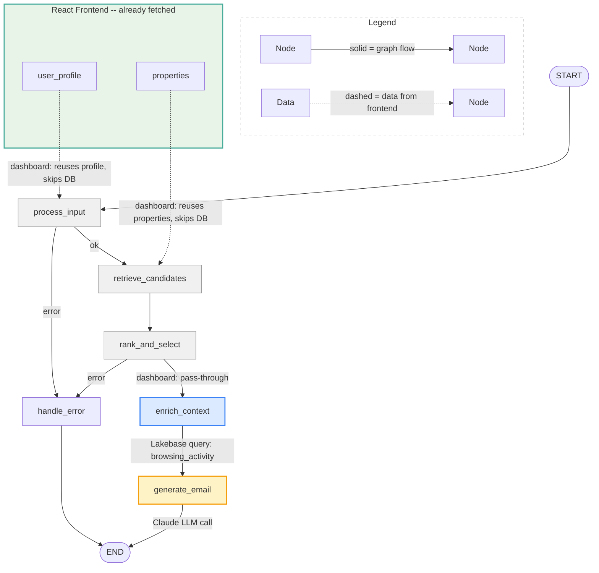

# CLAUDE.md

## Project Overview

Xome Campaign Platform — an AI-powered real estate campaign tool that generates personalized emails promoting recommended properties to high-intent buyers. Built with FastAPI backend, React + TailwindCSS frontend, LangGraph orchestration, deployed as a single-process Databricks App.

## Key Paths

- Backend: `agent_server/`
- REST API router: `agent_server/campaign_api.py`
- Chat API router: `agent_server/chat_api.py`
- LangGraph state: `agent_server/graph_state.py`
- LangGraph nodes: `agent_server/graph_nodes.py`
- LangGraph graph: `agent_server/graph.py`
- Email generation logic: `agent_server/email_generator.py`
- LLM setup: `agent_server/agent.py`
- SQL helper: `agent_server/tools.py`
- Prompts: `agent_server/prompts.py`
- Server entry point: `agent_server/start_server.py`
- Frontend (React): `frontend/`
- Frontend components: `frontend/src/components/`
- Dashboard API client: `frontend/src/api/campaign.ts`
- Chat API client: `frontend/src/api/chat.ts`
- Data generation: `notebooks/01_generate_data.py`
- Lakebase migration: `notebooks/02_migrate_to_lakebase.py`
- Deployment: `databricks.yml`, `app.yaml`

## Architecture

```
Browser → FastAPI (port 8000) → serves frontend/dist/ (static) + REST API (/api/campaign/*, /api/chat/*)
                                     │
                          ┌──────────┼──────────┐
                          ▼          ▼          ▼
                   LangGraph     Lakebase     UC Volume
                   StateGraph   (PostgreSQL)  (file storage)
                      │
                      ▼
                  Claude LLM
```

**Two UI paths, one pipeline:**
- Dashboard: `React UI → campaign_api.py → LangGraph (source=dashboard) → email_generator.py → Claude LLM`
- Chat: `React UI → chat_api.py → LangGraph (source=chat) → email_generator.py → Claude LLM`

**LangGraph StateGraph:**



**Dashboard path through the graph:**
| Node | Dashboard behavior | DB call? |
|------|-------------------|----------|
| `process_input` | Profile already provided by frontend — skip query | No |
| `retrieve_candidates` | Properties already provided by frontend — skip query | No |
| `rank_and_select` | Properties already curated by UI — pass through | No |
| `enrich_context` | Fetches last 20 browsing activities for personalization | **Yes (Lakebase)** |
| `generate_email` | Builds prompt → calls Claude → parses email sections | **Yes (LLM)** |

**Chat path:** All nodes are active — `process_input` extracts user_id from natural language, `retrieve_candidates` queries recommendations from Lakebase, `rank_and_select` sorts by score.

**Single-process deployment:** FastAPI on port 8000 serves both the pre-built React frontend (from `frontend/dist/`) and all API endpoints. Databricks Apps only exposes port 8000.

## Critical Rules

- Campaign email properties come ONLY from the `recommendations` table. Browsing data is for personalization context only.
- Frontend must be built (`cd frontend && npm run build`) before deploying — `frontend/dist/` is served as static files.
- `.gitignore` has `!frontend/dist/` exception to include the built frontend in bundle deploy.

## Configuration

- Catalog: `serverless_stable_14ey07_catalog` (used only for UC Volume file storage)
- Schema: `xome`
- Workspace: fevm (`https://fevm-serverless-stable-14ey07.cloud.databricks.com`)
- SQL Warehouse: `1f01d0f9de5b5108` (retained for UC Volume access)
- Lakebase Instance: `xome-campaign` (Provisioned, CU_2)
- Lakebase DNS: `ep-blue-shape-d2evoduc.database.us-east-1.cloud.databricks.com`
- Lakebase DB: `xome-campaign`, Schema: `xome`
- LLM: `databricks-claude-sonnet-4-6`
- UC Volume: `campaign_emails`
- App URL: `https://agent-xome-lakebase-campaign-7474645414452466.aws.databricksapps.com`

## REST API Endpoints

| Method | Path | Purpose |
|--------|------|---------|
| `GET` | `/api/campaign/filters` | Distinct cities, states, types, segments, price ranges |
| `POST` | `/api/campaign/users` | Top 20 users matching filters |
| `GET` | `/api/campaign/users/{id}/profile` | Full user profile |
| `POST` | `/api/campaign/users/{id}/listings` | Top 5 recommended properties |
| `POST` | `/api/campaign/generate-email` | Generate email via LangGraph (source=dashboard) |
| `POST` | `/api/campaign/save-email` | Save email to UC Volume |
| `POST` | `/api/chat/message` | Chat interface — natural language → LangGraph (source=chat) |
| `POST` | `/invocations` | MLflow-compatible endpoint → LangGraph (source=chat) |

## Common Commands

```bash
# Local dev (runs backend + frontend dev server concurrently)
uv run start-app

# Build frontend for production
cd frontend && npm run build && cd ..

# Deploy
databricks bundle deploy --target prod
databricks apps deploy agent-xome-lakebase-campaign --profile fevm --source-code-path /Workspace/Users/birbal.das@databricks.com/.bundle/xome_lakebase_campaign/prod/files

# Run data pipeline (generate Delta tables)
databricks bundle run xome_setup_pipeline --target prod

# Run Lakebase migration (copy Delta → Lakebase)
databricks bundle run xome_migrate_to_lakebase --target prod

# Check app status / logs
databricks apps get agent-xome-lakebase-campaign --profile fevm
databricks apps logs agent-xome-lakebase-campaign --profile fevm
```

## Data Tables

| Table | Rows | PK | FKs |
|-------|------|----|-----|
| `users` | 500 | `user_id` | — |
| `properties` | 1,000 | `property_id` | — |
| `browsing_activity` | 10,000 | `activity_id` | `user_id` → users, `property_id` → properties |
| `recommendations` | 5,000 | `recommendation_id` | `user_id` → users, `property_id` → properties |
| `campaign_tracking` | varies | — | `user_id` → users, `property_id` → properties |

## Dependencies

**Backend:** `fastapi`, `uvicorn`, `databricks-langchain`, `databricks-sdk`, `python-dotenv`, `langgraph`, `psycopg2-binary`. Data gen uses `faker`.

**Frontend:** `react`, `vite`, `tailwindcss`, `lucide-react`, `typescript`.

## Known Deployment Notes

- Frontend must be built before deploy — `frontend/dist/` is served as static files by FastAPI.
- `frontend/dist/` must be included in bundle deploy — the `!frontend/dist/` exception in `.gitignore` overrides the global `dist/` exclusion pattern.
- npm registry: `.npmrc` in `frontend/` points to `https://registry.npmmirror.com` for corporate network compatibility.
