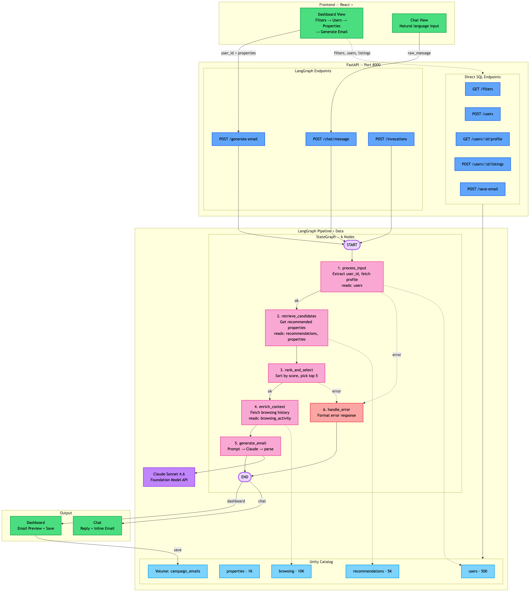

# Xome Campaign Platform

An AI-powered real estate campaign tool that generates personalized emails promoting recommended properties to high-intent buyers. Built with FastAPI backend, React + TailwindCSS frontend, LangGraph orchestration, and deployed as a single-process Databricks App.



---

## How It Works

### Genie User Discovery

1. Type a natural language query in the **Genie search bar**, e.g. "Show me investors in Miami"
2. Genie Spaces translates the query to SQL and returns results as a raw table
3. **Clickable `user_id` cells** navigate to the user detail view with profile, recommended properties, and email generation
4. **Clickable `property_id` cells** open a property detail modal with image, stats, and description
5. Use **follow-up queries** to refine results — the conversation context is preserved
6. Click **New Search** to start a fresh conversation

### Dashboard Email Generation

1. From the user detail view, review the user's profile and recommended properties
2. Use the **filter sidebar** to narrow down by city, state, price range, property type, segment, and listing count (1–30)
3. Click **Generate Email** — LangGraph fetches browsing history for personalization, then Claude generates a personalized HTML email
4. Preview the email (HTML or plain text), click property links to see detail modals
5. Click **Save** to persist the email to Lakebase and record each property in `campaign_tracking`
6. Properties already sent in a campaign display a **"Campaign sent on {date}"** banner

**Critical rule:** Campaign properties come exclusively from the `recommendations` table. Browsing data is used for personalization tone only.

---

## Architecture

```
Browser → FastAPI (port 8000) → serves frontend/dist/ (static) + REST API (/api/campaign/*)
                                     │
                          ┌──────────┼──────────┐
                          ▼          ▼          ▼
                   LangGraph     Lakebase     Genie Spaces
                   StateGraph   (PostgreSQL)  (NL queries)
                      │
                      ▼
                  Claude LLM
```

**Single-process deployment:** FastAPI on port 8000 serves both the pre-built React frontend (from `frontend/dist/`) and all API endpoints. Databricks Apps only exposes port 8000.

**Dev mode:** `uv run start-app` launches backend (port 8000) and Vite dev server (port 3000) concurrently. Vite proxies `/api` requests to `localhost:8000` (configured in `vite.config.ts`).

---

## LangGraph Pipeline

Two paths (4 nodes total) routed by the `source` field in `CampaignState`:

**Dashboard** (`source=dashboard`): `route_entry → enrich_context → generate_email → END`
- Frontend provides user profile + selected properties via the API request
- `enrich_context` fetches browsing history from Lakebase for personalization
- `generate_email` validates inputs, builds the prompt, and calls Claude

**Genie** (`source=genie`): `route_entry → query_genie → END`
- First query calls `start_conversation()` on the Genie Spaces API
- Follow-up queries call `create_message()` on the same conversation
- Returns raw `columns` + `rows` directly to the frontend as a table

**MLflow Tracing** — `mlflow.langchain.autolog()` traces the overall graph invocation and LLM calls. Manual `@mlflow.trace` decorators on `enrich_context`, `generate_email`, and `query_genie_node` capture per-node input/output as child spans. Traces are logged to the experiment `/Shared/xome-lakebase-campaign-tracing`.

---

## REST API

All endpoints are prefixed with `/api/campaign`.

| Method | Path | Purpose |
|--------|------|---------|
| `GET` | `/filters` | Distinct cities, states, types, segments, price ranges |
| `POST` | `/genie-query` | Natural language query → raw columns + rows from Genie Spaces |
| `GET` | `/properties/{id}` | Full property details by ID |
| `GET` | `/users/{id}/profile` | Full user profile |
| `POST` | `/users/{id}/listings` | Top recommended properties for a user |
| `POST` | `/generate-email` | Generate email via LangGraph (source=dashboard) |
| `POST` | `/save-email` | Save email to Lakebase |

---

## Data Model

Six tables in Lakebase (PostgreSQL). First four seeded by notebooks, last two auto-created at startup:

| Table | Rows | Description |
|-------|------|-------------|
| `users` | 500 | Buyer profiles with preferences (city, state, budget, property type, segment) |
| `properties` | 1,000 | Listings with details (price, beds, baths, sqft, neighborhood, school rating, auction info) |
| `browsing_activity` | 10,000 | User browsing events linked to properties |
| `recommendations` | 5,000 | ML-scored property recommendations per user (score 0.0–1.0) |
| `campaign_tracking` | — | Records which emails were sent for which user+property+recommendation |
| `campaign_emails` | — | Saved email content (subject, html_body, plain_text, filename) |

CSV exports of all tables are available in `data/` for offline reference.

---

## Project Structure

```
agent_server/
  campaign_api.py      # REST API router
  genie_client.py      # Genie Spaces SDK client
  graph.py             # LangGraph StateGraph definition
  graph_nodes.py       # LangGraph node implementations
  graph_state.py       # CampaignState TypedDict
  email_generator.py   # Email generation + parsing
  agent.py             # LLM setup (_SanitizedChatDatabricks)
  tools.py             # Lakebase helper (psycopg2 + connection pooling)
  prompts.py           # LLM prompt templates
  config.py            # Configuration constants
  start_server.py      # FastAPI entry point + lifespan hooks
frontend/
  src/
    api/campaign.ts    # API client functions
    components/
      layout/          # AppShell, Header, Sidebar
      genie/           # GenieSearchBar, GenieResultTable, GenieUserDetail
      filters/         # FilterPanel
      users/           # UserProfileCard
      properties/      # PropertyCard, PropertyGrid, PropertyDetailModal
      email/           # EmailPreview, EmailActions
    types/index.ts     # TypeScript interfaces
  dist/                # Built frontend (served as static files)
data/
  users.csv                   # 500 buyer profiles
  properties.csv              # 1K property listings
  browsing_activity.csv       # 10K browsing events
  recommendations.csv         # 5K ML-scored recommendations
  campaign_tracking.csv       # Campaign send records
  campaign_emails.csv         # Saved email content
notebooks/
  01_generate_data.py         # Data generation pipeline
  02_migrate_to_lakebase.py   # Delta → Lakebase migration
pipeline_flow.mmd    # Architecture diagram (Mermaid source)
pipeline_flow.png    # Architecture diagram (rendered)
databricks.yml       # Bundle config
app.yaml             # Databricks Apps runtime config
```

---

## Getting Started

### Prerequisites

- Python 3.11+
- [uv](https://docs.astral.sh/uv/) for Python package management
- Node.js / npm for frontend
- [Databricks CLI](https://docs.databricks.com/dev-tools/cli/install.html) configured with `fevm` profile

### Local Development

```bash
# Install frontend dependencies
cd frontend && npm install && cd ..

# Run backend (port 8000) + frontend dev server (port 3000) concurrently
uv run start-app
```

Open http://localhost:3000 in your browser. Vite proxies `/api` requests to `localhost:8000`.

### Build & Deploy

```bash
# Build frontend
cd frontend && npm run build && cd ..

# Deploy bundle + app
databricks bundle deploy --target prod
databricks apps deploy xome-lakebase-campaign-genie --profile fevm \
  --source-code-path /Workspace/Users/birbal.das@databricks.com/.bundle/xome_lakebase_campaign_genie/prod/files
```

### Data Pipeline

```bash
# Generate Delta tables
databricks bundle run xome_setup_pipeline --target prod

# Copy Delta → Lakebase
databricks bundle run xome_migrate_to_lakebase --target prod
```

### Check App Status

```bash
databricks apps get xome-lakebase-campaign-genie --profile fevm
databricks apps logs xome-lakebase-campaign-genie --profile fevm
```

---

## Configuration

| Setting | Value |
|---------|-------|
| Workspace | fevm (`https://fevm-serverless-stable-14ey07.cloud.databricks.com`) |
| App URL | `https://xome-lakebase-campaign-genie-7474645414452466.aws.databricksapps.com` |
| Genie Space ID | `01f1484fd22e1d558c5ed706de7b522d` |
| LLM Endpoint | `databricks-claude-sonnet-4-6` |
| Database | Lakebase (Managed PostgreSQL) |
| Tracing | MLflow (`/Shared/xome-lakebase-campaign-tracing`) |

All other config values (catalog, schema, Lakebase DNS, etc.) are in `agent_server/config.py`.

---

## Dependencies

**Backend (Python):** `fastapi`, `uvicorn`, `databricks-langchain`, `databricks-sdk`, `psycopg2`, `langgraph`, `mlflow`

**Frontend (Node.js):** `react`, `vite`, `tailwindcss`, `lucide-react`, `typescript`
