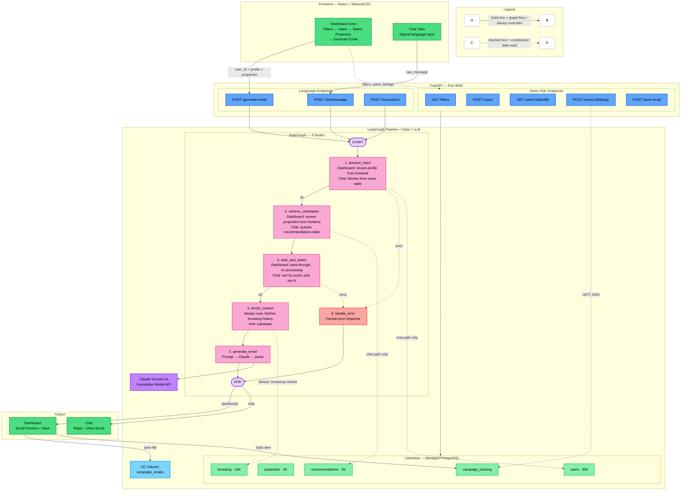

# Xome Campaign Platform — Workflow

## Architecture Diagram



---

## Technology Stack

| Layer | Technology | Purpose |
|-------|-----------|---------|
| Frontend | React + TailwindCSS + Vite | Dashboard & Chat UI |
| Backend | FastAPI (Python) | REST API, static file serving |
| Orchestration | LangGraph StateGraph | 6-node agentic pipeline |
| LLM | Claude Sonnet 4.6 (Foundation Model API) | Email content generation |
| Database | Lakebase (Managed PostgreSQL) | OLTP queries, user/property data |
| Storage | Unity Catalog Volume | Persisted email HTML files |
| Tracing | MLflow Autolog | LangGraph node I/O tracing |
| Deployment | Databricks Apps | Single-process, port 8000 |

## Data Model (Lakebase)

| Table | Rows | Primary Key | Description |
|-------|------|-------------|-------------|
| users | 500 | user_id | Buyer profiles: name, email, preferences, budget, segment |
| properties | 1,000 | property_id | Listings: address, price, beds/baths, sqft, school rating |
| recommendations | 5,000 | recommendation_id | ML-scored user-property matches with reasons |
| browsing_activity | 10,000 | activity_id | Clickstream: views, searches, favorites, sessions |
| campaign_tracking | varies | (none) | Tracks which emails have been sent per user-property pair |

## REST API Endpoints

| Method | Path | Purpose |
|--------|------|---------|
| GET | /api/campaign/filters | Distinct cities, states, types, segments, price ranges |
| POST | /api/campaign/users | Top 20 users matching filter criteria |
| GET | /api/campaign/users/{id}/profile | Full buyer profile |
| POST | /api/campaign/users/{id}/listings | Top 5 recommended properties with campaign status |
| POST | /api/campaign/generate-email | Generate email via LangGraph (source=dashboard) |
| POST | /api/campaign/save-email | Save email HTML to UC Volume + track in campaign_tracking |
| POST | /api/chat/message | Chat interface — natural language to LangGraph (source=chat) |
| POST | /invocations | MLflow-compatible endpoint for model serving |

## LangGraph Pipeline — Node Details

### Node 1: process_input
- **Dashboard path:** Frontend already loaded the user profile. Pass-through, zero DB queries.
- **Chat path:** Extracts user_id from natural language, queries the `users` table.

### Node 2: retrieve_candidates
- **Dashboard path:** Frontend already selected properties. Pass-through.
- **Chat path:** Queries `recommendations` joined with `properties` for ML-scored matches.

### Node 3: rank_and_select
- **Dashboard path:** Pass-through — user already chose properties in the UI.
- **Chat path:** Sorts by recommendation_score descending, picks top N.

### Node 4: enrich_context
- **Both paths:** Always queries `browsing_activity` joined with `properties` for recent user behavior (views, searches, favorites, session durations).

### Node 5: generate_email
- Assembles prompt with buyer profile, selected properties, and browsing context.
- Calls Claude Sonnet 4.6 via Foundation Model API.
- Parses response into subject line and HTML body.

### Node 6: handle_error
- Catches errors from nodes 1 and 3, formats user-friendly error response.

## Data Flow

### Dashboard Path (Optimized)

```
User selects filters → Frontend calls /filters, /users, /profile, /listings
  → User clicks "Generate Email" with selected properties
  → POST /generate-email sends user profile + properties to LangGraph
  → Nodes 1-3: pass-through (data already provided by frontend)
  → Node 4: queries browsing_activity from Lakebase
  → Node 5: Claude generates personalized email
  → Email displayed for review
  → User clicks "Save" → HTML saved to UC Volume + campaign_tracking updated
```

### Chat Path (Autonomous)

```
User types natural-language request
  → POST /chat/message sends raw_message to LangGraph
  → Node 1: queries users table from Lakebase
  → Node 2: queries recommendations + properties from Lakebase
  → Node 3: ranks and selects top properties
  → Node 4: queries browsing_activity from Lakebase
  → Node 5: Claude generates personalized email
  → Email returned inline in chat response
```
